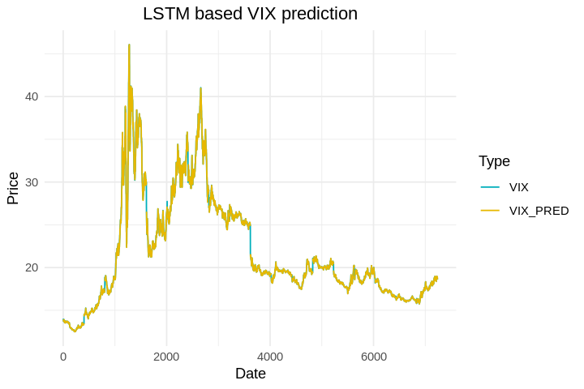

[](http://quantlet.de/)

## [](http://quantlet.de/) **VIXDeepLearning** [](http://quantlet.de/)

```yaml


Name of Quantlet : VIXDeepLearning

Published in :  'Neural Networks and Arbitrage in the VIX. A Deep Learning Approach for the VIX'

Description : 'Contains the LSTM model used to predict the VIX index by using the SP500 option intraday data.'

Keywords : 
 - VIX
 - SP500
 - LSTM

Author : Daniel Kucharczyk

Submitted :  Fri, Feb 19 2019 by Daniel Kucharczyk

Datafile : data/raw/VIX_SP500.RData

Example: LSTM based VIX index prediction using SP500 data.

```



### R Code
```r

# clear variables and close windows
rm(list = ls(all = TRUE))
graphics.off()

# install and load packages
libraries = c("keras", "lubridate", "tidyverse", "reticulate")
lapply(libraries, function(x) if (!(x %in% installed.packages())) {
    install.packages(x)
})
lapply(libraries, library, quietly = TRUE, character.only = TRUE)

# load the data Make surce the main repo folder has been set up as a working directory DATETIME is given in CET
df <- readRDS(file.path(getwd(), "VIXDeepLearning", "data", "raw", "VIX_Sp500.Rdata"))

# Calculate log-returns
log_df <- df %>% arrange(DATETIME) %>% group_by(DATE) %>% mutate_at(vars(-DATETIME, -DATE), .funs = function(x) log(x/lag(x))) %>% ungroup() %>% select(DATETIME, 
    DATE, everything()) %>% mutate(VIX_PRED = lead(VIX)) %>% drop_na()

# Split the data into train and test datasets
train_interval <- interval("2018-01-01", "2018-01-31", tz = "CET")
train_df <- log_df %>% filter(DATETIME %within% train_interval)

x_train <- train_df %>% select(-DATE, -DATETIME, -VIX, -VIX_PRED)
y_train <- train_df %>% select(VIX_PRED)

test_interval <- interval("2018-02-01", "2018-02-28", tz = "CET")
test_df <- log_df %>% filter(DATETIME %within% test_interval)

x_test <- test_df %>% select(-DATE, -DATETIME, -VIX, -VIX_PRED)
y_test <- test_df %>% select(VIX_PRED)

# Data manipulation required by LSTM model
x_train_lstm <- as.matrix(x_train)
dim(x_train_lstm) <- c(dim(x_train)[[1]], 1, dim(x_train)[[2]])
y_train_lstm <- as.array(unlist(y_train))

x_test_lstm <- as.matrix(x_test)
dim(x_test_lstm) <- c(dim(x_test)[[1]], 1, dim(x_test)[[2]])
y_test_lstm <- as.array(unlist(y_test))

# Define the model
model <- keras_model_sequential()

model %>% layer_lstm(units = 50, input_shape = c(1, 10), batch_size = 10, return_sequences = FALSE, activation = "tanh", stateful = TRUE, dropout = 0.2) %>% 
    layer_dense(units = 1, activation = "linear")

model %>% compile(loss = "mse", optimizer = optimizer_adam(lr = 10^-3, decay = 0.001), metrics = c("mae", "mse"))

# Train the model
model %>% fit(x_train_lstm, y_train_lstm, batch_size = 10, epochs = 10, verbose = 2, shuffle = FALSE, validation_split = 0.2)

# Predict VIX return using the test data
y_test_predict <- model %>% predict(x_test_lstm, batch_size = 10, verbose = 1)

# Add prediction column to the initial dataset
test_df %>% add_column(MODEL_PRED = as.vector(y_test_predict))

model_vix_ret_pred <- test_df %>% select(DATETIME, MODEL_PRED)

# Compare the model prediction on the index level
vix_pred <- df %>% filter(DATE %within% test_interval) %>% select(DATETIME, VIX) %>% left_join(model_vix_ret_pred) %>% mutate(VIX_PRED = lag(VIX * exp(MODEL_PRED)))

# Plot the results using ggplot
vix_plot_data <- vix_pred %>% select(-MODEL_PRED) %>% gather(Type, Price, -DATETIME)
vix_plot_data <- vix_plot_data %>% group_by(Type) %>% mutate(id = row_number())

ggplot(vix_plot_data, aes(x = id, y = Price)) + geom_line(aes(color = Type), size = 0.5) + scale_color_manual(values = c("#00AFBB", "#E7B800")) + theme_minimal() + 
    scale_x_continuous(name = "Observation") + ggtitle("LSTM based VIX prediction") + theme(plot.title = element_text(hjust = 0.5))

ggsave(file.path(getwd(), "VIXDeepLearning", "LSTM_VIX_Prediction.png"), dpi = 120, width = 6, height = 4, units = "in")

```

automatically created on 2019-02-20